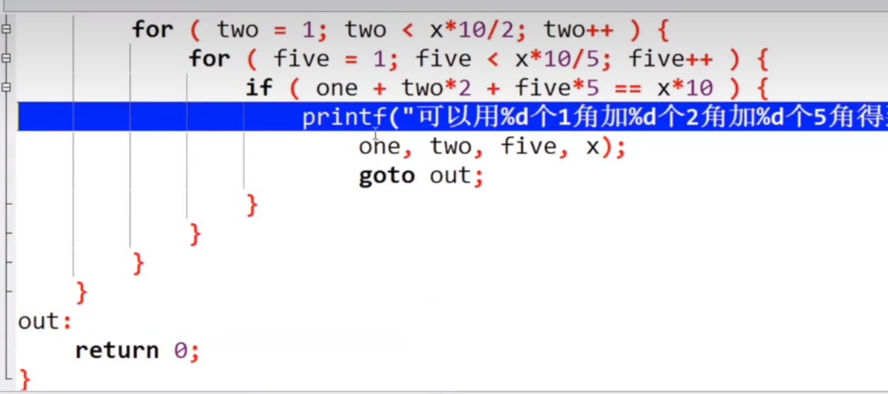
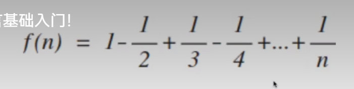
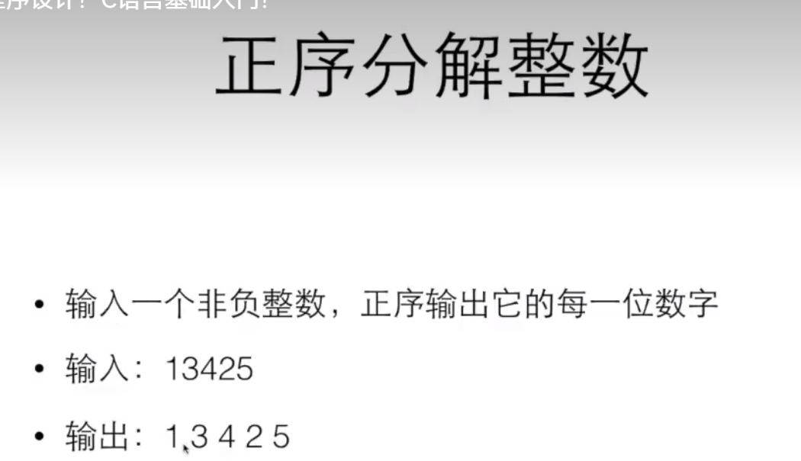
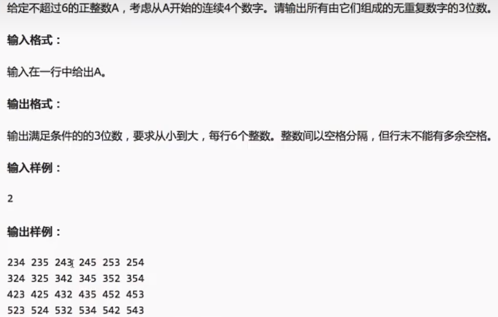
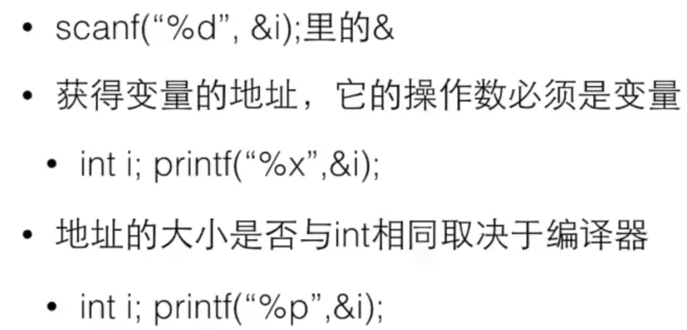
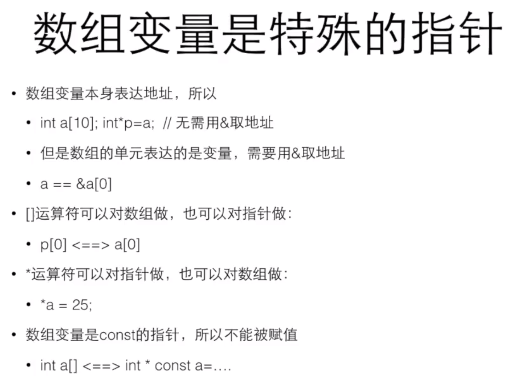

## C语言遇到的好题

#### 判断一个数有多少位数。

如：输入 123 则输出 3
	   输入 123456789 则输出 9

```c
#include <stdio.h>
#include <stdlib.h>

int NumberCycleDividedByTen(int number)
{
    int count = 0;
    count ++;
    number /= 10;
    while (number > 0)
    {
        count ++;
        number /= 10;
    }
    return count;
}
int main()
{
    int number=0;
    int cycle = 0;
    printf("Enter the Number: \n");
    scanf("%d", &number);
    printf("The Number is %d\n", number);
    cycle = NumberCycleDividedByTen(number);
    printf("The Number is %d Wei Su\n", cycle);
}
```


#### 数的逆位输出

如：输入 123
	   输出 321

```c
#include <stdio.h>
#include <stdlib.h>

int main()
{
    int number=0;
    int NiWei_number=0;
    printf("input number:\n");
    scanf("%d", &number);
    NiWei_number=number%10*100+number%100/10*10+number/100;
    printf("output NiWei_number:");
    printf("%d\n",NiWei_number);
    system("pause");
    return 0;
}
```

 

#### 计算经过一段时间到了几点

如： 输入 1120 110
		输出  1310

```c
#include <stdlib.h>
#include <stdio.h>

int main()
{
    int time;
    int through_minutes=0;

    printf("Enter the time and through minutes:\n");
    scanf("%d %d",&time,&through_minutes);
    time = (time/100*60+time%100+through_minutes)/60*100+((time/100*60+time%100+through_minutes)%60);
    printf("now_time:%d\n",time);
    system("pause");
    return 0;
}
```


#### 求输入数组的平均数

如：输入 12 回车 13 回车 -1 回车
	   输出 12.500

```c
#include <stdlib.h>
#include <stdio.h>

int main()
{
    int count = 0;
    float sum = 0;
    int num = 0;
    printf("Enter the Array of Number.\n");
    printf("Enter the -1 to end.\n");
    printf("After entering the number, press key of enter to enter the next one.\n");

    // do
    // {
    //     scanf("%d", &num);
    //     if (num != -1)
    //     {
    //         count ++;
    //         sum += num;
    //     }
    // } while (num != -1);

    scanf("%d", &num);
    while (num != -1)
    {
        sum += num;
        count ++;
        scanf("%d", &num);
    }   

    sum = sum / count;
    printf("The average of the input array is %.3f.\n", sum);
    system("pause");
    return 0;
}
```


#### 整数的逆序输出

如：输入 12345
	    输出 54321

````c
#include <stdio.h>
#include <stdlib.h>

int main()
{
    int num = 12345;
    int digit = 0;
    int ret = 0;
    
    printf("input number:\n");
    scanf("%d", &num);

    while (num > 0)
    {
        digit = num % 10;
        ret = ret * 10 + digit;
        num /= 10;
    }
    
    printf("Inverted Output Of Integers: %d\n", ret);
    system("pause");
    return 0;
}
````

```c
#include <stdio.h>
#include <stdlib.h>

int main()
{
    int length;
    printf("Enter the length of the array: ");
    scanf("%d", &length);
    int* arr = (int*)malloc(length * sizeof(int));
    if (arr == NULL) {
        printf("Memory allocation failed!\n");
        return 1;
    }
    int count = 0;
    int value;
    printf("Enter %d elements of the array:\n",length);
    while (count < length) {
        scanf("%d", &value);
        if (value != -1) {
            arr[count] = value;
            count++;
        }
    }
    for (int right = length - 1; right >= 0; right--) {
        printf("%d", arr[right]);
    }
    free(arr);  
    system("pause");
    return 0;
}

```


#### 整数的阶乘

如：输入 5 输出 120

```c
#include <stdio.h>
#include <stdlib.h>

int Factorization(int number)
{
    int factorization = 1;
    int i = 1 ;
    while (i <= number)
    {
        factorization *= i;
        i++;
    }
    return factorization;
}


int main()
{
    int number = 0 ;
    printf("Enter a number : \n");
    scanf("%d", &number);
    int factorial = Factorization(number);
    printf("Factorial of %d is %d.\n", number, factorial);
    system("pause");
    return 0;
}
```


#### 素数的判断

**素数是指只能被1或自身整除的正整数，不能被其他整数整除的正整数。**
如： 输入 65 输出 The number is not prime number.
		输入   2 输出 The number is prime number.

```c
#include <stdio.h>
#include <stdlib.h>

int main()
{
    printf("Enter the X: ");
    int x = 0 ;
    scanf("%d", &x);
    int i = 2;
    int isPrime = 1 ;
    for ( ; i < x; i++)
    {
        if (x % i == 0)
        {
            isPrime = 0;
            break;
        }
    }
    
    if (isPrime == 1)
    {
        printf("The number is prime number.\n");
    }
    else
    {
        printf("The number is not prime number.\n");
    }
    
    system("pause");
    return 0;
}
```


#### 输出100以内的素数

```c
#include <stdio.h>
#include <stdlib.h>

int main()
{
    int i=2;
    int x = 2;
    int isPrime = 1 ;

    for( ;x<100;x++)
    {
        for ( ; i < x; i++)
        {
            if (x % i == 0)
            {
                isPrime = 0;
                break;
            }
        }

        if (isPrime == 1)
        {
            printf("%d ", x);
        }
    }
    printf("\n");
    system("pause");
    return 0; 
}
```


#### 用1角、2角、5角得到一个10元以下的面值

如 ：输入 5 
		输出 用1个1角、2个2角、9个5角可以得到5元

```c
#include <stdio.h>
#include <stdlib.h>

int main()
{
    int x=5;
    printf("Enter integers below 10.\n");
    scanf("%d",&x);
    int one, two, five;
    int exit = 0;
    for (one = 1; one < x * 10;one++)
    {
       for (two = 1; two < x * 10/2;two++)
       {
        for (five = 1; five < x * 10/5;five++)
        {
            if (one * 1 + two * 2 + five * 5 == x * 10 )
            {
                printf("Use %d 1jiao %d 2jiao %d 5jiao Dei dao : %d\n", one, two, five, x);
                exit = 1;
                break;
            }
        }
         if (exit == 1)
            {
                break;
            } 
       }
        if (exit == 1)
            {
                break;
            }  
    }

    system("pause");
    return 0;
}
```




#### 求n的前n项1/n的和(中间符号有变化)



```c
#include <stdio.h>
#include <stdlib.h>


// int main()
// {
//     int n = 0;
//     double sum = 0.0;
//     int i;
//     printf("Please input the number of terms: \n");
//     scanf("%d", &n);
//     for (i = 1; i <= n; i++)
//     {
//         sum += 1.0/i;
//     }
//     printf("sum = %f\n", sum);
// }


int main()
{
    int n = 0;
    double sum = 0.0;
    int i;
    int sign = 1;
    printf("Please input the number of terms: \n");
    scanf("%d", &n);
    for (i = 1; i <= n; i++)
    {
        sum += sign*1.0/i;
        sign = -sign;
    }
    printf("sum = %f\n", sum);
}
```


#### 正序分解正整数



思路：
1. 首先算出13425的位数，他是几位数？

2. 在算的过程中可以让一个mask的变量由1每一轮乘以10

3. 循环条件要让mask不是个位数的时候执行

4. 这样的mask最终是一个(10*位数)的值

5. 然后用这个mask来做文章，得到13425每一个数位上的数

   a.定义一个变量来表示每次被分出来的值

 ```c
 #include <stdio.h>
 #include <stdlib.h>
 
 int main()
 {
     int num = 13425;
 
     // mask is : 10 ** (digits-1)
     
     int mask = 1;
     int num_wei= 0;
 
     printf("input number:\n");
     scanf("%d", &num);
     
     int num_count = num;
 
     // Need to get the number of digits 
     // But not only the number of digits
     // Need the 10 ** (digits-1)
 
     while (num_count > 9)
     {
         num_count /= 10;
         mask *= 10;
     }
     printf("mask=%d \n",mask);
 
     printf("The num Fenli is:\n");
 
     do
     {
         num_wei = num / mask;
         printf("%d",num_wei);
         
         // Because end of num is not blank space
         // So need to add "if"
         
         if (mask > 9)
         {
            printf(" "); 
         }
         num %= mask;
         mask /= 10;
     } while (mask > 0);
     
     printf("\n");
     system("pause");
     return 0;
 }
 ```

```c
#include <stdio.h>
#include <stdlib.h>

int main()
{
    int n,t=1;
    int cnt=0;
    scanf("%d",&n);

    while(n/t)
    {
        t*=10;
    }
    t/=10;
    while(n)
    {
        if (t > 9)
        {
           printf("%d ",n/t%10);
           t/=10;
        }
        else
        {
           printf("%d",n/t%10);
           t/=10;
        }
    }

    printf("\n");
    system("pause");
    return 0;
}
```


#### 求符合给定条件的整数集



```c
#include <stdio.h>
#include <stdlib.h>

int main()
{
    int num = 0;
    printf("Enter the Num,Max not until 6\n");
    scanf("%d", &num);
    int i,j,k;
    int cnt = 0;
    
    printf("%d Mei Ju Num Pai Lie is : \n",num);
    
    i=num;
    while (i<=num+3)
    {
        j=num;
        while (j<=num+3)
        {
            k=num;
            while (k<=num+3)
            {
                if (i!=j && i!=k && j!=k)
                {
                    printf("%d%d%d",i,j,k);
                    cnt++;
                    if (cnt == 6)
                    {
                        printf("\n");
                        cnt = 0;
                    }
                    else
                    {
                        printf(" ");
                    }
                }
                k++;
            }
            j++;
        }
        i++;
    }
       

    system("pause");
    return 0;
}
```


#### 水仙花数

水仙花数（Narcissistic number）也被称为 超完全数字不变数 （pluperfect digital invariant, PPDI）、 自恋数 、 自幂数 、阿姆斯壮数或 阿姆斯特朗数 （Armstrong number），**水仙花数是指一个 3 位数，它的每个数位上的数字的 3次幂之和等于它本身。** 

**水仙花数是指一个N位正整数（N>=3)，它的每个位上的数字的N次幂之和等于它本身。**

例如：1^3 + 5^3+ 3^3 = 153。


主要逻辑如下：

1. 用户输入一个整数`x`，表示数字的位数。
2. 计算出这个数位下的最大可能数字（例如，如果`x`是3，那么最大数字是999）。
3. 从这个最大数字开始，逐个检查每个数字，看它是否是一个Narcissistic Number。
4. 如果一个数字满足Narcissistic Number的定义，就打印出这个数字。

```c
#include <stdio.h>
#include <stdlib.h>

// This code is a C program that finds all the Narcissistic Numbers under a given number of digits (entered by the user).

// First, let me explain what a Narcissistic Number is: a Narcissistic Number is an n-digit number whose sum of 
// the numbers in each bit to the power of n is equal to itself.

// The main logic of the program is as follows:

// The user enters an integer x representing the number of digits.
// Calculate the largest possible number for this number (for example, if x is 3, then the largest number is 999).
// Starting with the largest number, check each number one by one to see if it is a Narcissistic Number.
// If a number meets the definition of Narcissistic Number, it is printed.

// Narcissistic Number Enter X Wei Number
// Output All Narcissistic Number of X Wei Number

int main()
{
    int x;
    x=3;
    printf("Enter X : ");
    scanf("%d", &x);
    int first=1;
    int i=1;
    while (i<x)
    {
        first*=10;
        i++;
    }
    i = first;
    while (i<first*10)
    {
        int t = i;
        int sum=0;
        do
        {
            int d=t%10;
            t/=10;
            int p=d;
            int j=1;
            while (j<x)
            {
                p*=d;
                j++;
            }
            sum+=p;
        } while (t>0);
        if (sum==i)
        {
            printf("%d\n", i);
        }
        i++; 
    }
    system("pause");
    return 0;
}
```


#### 统计素数并求和

本题要求统计给定整数M和N区间内素数的个数并对它们求和。
输入格式:
输入在一行中给出2个正整数M和N（ 1<=M<=N<=500 )。
输出格式:
在一行中顺序输出M和N区间内素数的个数以及它们的和，数字间以空格分隔。
输入样例:
10 31
输出样例:
7 143

```c
#include <stdio.h>
#include <stdlib.h>

int main()
{
    int m,n;
    int cnt = 0;
    int sum = 0;
    scanf("%d %d",&m,&n);
    if (m==1)
    {
        m=2;
    }
    int i;
    for (i = m; i <= n; i++)
    {
        int isPrime = 1;
        int k;
        for (k = 2;k <i; k++)
        {
            if (i % k == 0)
            {
                isPrime = 0;
                break;
            }
        }
        if (isPrime)
        {
            cnt++;
            sum += i;
        }
    }
    printf("%d %d\n",cnt,sum);
    system("pause");
    return 0;
}
```


#### 求序列前N项和

本题要求编写程序,计算序列2/1+3/2+5/3+8/5+...的前N项之和。注意该序列从第2项起，每一项的分子是前一项分子与分母的和，分母是前一项的分子。
输入格式:
输入在一行中给出一个正整数N。
输出格式:
在一行中输出部分和的值，精确到小数点后2位。题目保证计算结果不超过双精度范围。
输入样例︰
20
输出样例∶
32.66

```c
#include <stdio.h>
#include <stdlib.h>

int main()
{
    int num;
    double Z,M;
    double sum = 0.0;
    double t;
    int i;
    scanf("%d", &num);
    Z = 2;
    M = 1;
    for (i = 1; i <= num; i++)
    {
        sum += Z/M;
        t=Z;
        Z = Z+M;
        M = t;
    }
    printf("%.2f.\n",sum);
    system("pause");
    return 0;
}
```


#### 约分最简式

分数可以表示为"分子/分母"的形式。编写一个程序，要求用户输入一个分数，然后将其约分为最简分式。最简分式是指分子和分母不具有可以约分的成分了。如6/12可以被约分为1/2。当分子大于分母时，不需要表达为整数又分数的形式，即11/8还是11/8;而当分子分母相等时，仍然表达为1/1的分数形式。
输入格式:
输入在一行中给出一个分数，分子和分母中间以斜杠"/"分隔，如∶12/34表示34分之12。分子和分母都是正整数（不包含O，如果不清楚正整数的定义的话）。
提示:在scanf的格式字符串中加入"/”，让scanf来处理这个斜杠。
输出格式:
在一行中输出这个分数对应的最简分式，格式与输入的相同，即采用"分子/分母”的形式表示分数。如5/6表示6分之5。
输入样例:
60/120
输出样例:
1/2

```c
#include <stdio.h>
#include <stdlib.h>

int main()
{
    int divident,divisor;
    scanf("%d/%d",&divident,&divisor);
    int a = divident;
    int b = divisor;
    int t = 0;
    while (b > 0)
    {
        t = a % b;
        a = b;
        b = t;
    }
    printf("%d/%d\n",divident/a,divisor/a);
    system("pause");
    return 0;
}
```


#### C语言求int型最大的数

不要使用标准库函数INT_MAX

```c
#include <stdio.h>  
  
int max_int() {  
    int result = 0;  
    int i;  
    for (i = 0; i < 31; i++) {  
        result = result | (1 << i); // 将第i位设置为1  
    }  
    return result;  
}  
  
int main() {  
    int max = max_int();  
    printf("The maximum value of int is: %d\n", max);  
    return 0;  
}
```


#### 字符大小写转换

读取一个字符字母 如果是小写 将他转换为 大写 反之则转换为小写 不能使用库函数

```c
#include <stdio.h>  
  
int main() 
{
    char c;  
    printf("请输入一个字符：");  
    scanf("%c", &c);  
    if (c >= 'a' && c <= 'z') 
    {  
        c = c - 'a' + 'A';  
    } else if (c >= 'A' && c <= 'Z') 
    { 
        c = c - 'A' + 'a';  
    }  
    printf("转换后的字符为：%c\n", c);  
    return 0;  
}
```


#### 统计数字出现的次数

写一个程序，输入数量不确定的[0,9]范围内的整数,统计每一种数字出现的次数,输入-1表示结束

```c
#include <stdio.h>

int main()
{
    const int number = 10;   // c99 standard
    int x;
    int count[number];
    int i;
    for(i=0;i<number;i++)
    {
        count[i]=0;
    }
    scanf("%d",&x);
    while(x!=-1)
    {
        if(x>=0 && x<=9)
        {
            count[x]++;
        }
        scanf("%d",&x);
    }
    for(i=0;i<number;i++)
    {
        printf("%d:%d\n",i,count[i]);
    }
    printf("\n");
    return 0;
}
```


#### 数组中的最值

找出长度为len的数组中的最大值和最小值

```c
#include <stdio.h>

// Find the maximum and minimum values in an array of length.
void FindMixMin(int a[], int len, int *max , int *min)
{
    int i;
    *max=*min=a[0];
    for (i = 1; i < len; i++)
    {
        if (a[i] < *min)
        {
            *min = a[i];
        }
    }
    for (i = 1; i < len; i++)
    {
        if (a[i] > *max)
        {
            *max = a[i];
        }
    }
}


int main()
{
    int a[] = {1, 2, 3, 4, 5, 6, 7, 8, 9, 10, 15, 12, 13, 14, 16, 17, 18, 19, 20};
    int mix,min;
    FindMixMin(a, sizeof(a)/sizeof(a[0]), &mix, &min);
    printf("Mix is %d, Min is %d .\n", mix, min);
    return 0;
}
```


## C语言小知识

#### 逃逸字符

用来表达无法印出来的控制字符或特殊字符，它由一个反斜杠开头，后面跟上另一个字符，这两个字符合起来，组成了一个字符

```c
printf("\" 5 \"");
```


#### 自动类型转换

+ 当运算符的两边出现不一致的类型时，会自动转换成较大的类型

	大的意思是能表达的数的范围更大char —> short —> int —> long ——>long long
	int ——> float—> double

+ 对于printf，任何小于int的类型会被转换成int; float会被转换成double
	但是scanf不会，要输入short，需要%hd


#### 强制类型转换

+ 要把一个量强制转换成另一个类型（通常是较小的类型），需要:
	(类型)值

```c
(type)value  
```

+ 比如:
	(int)10.2
	(short)32
+ 注意这时候的安全性，小的变量不总能表达大的量
	+ input: (short)32768
		output: -32768

+ 只是从那个变量计算出了一个新的类型的值,它并不改变那个变量,无论是值还是类型都不改变
+ 强制类型转换的优先级高于四则运算


#### 逻辑运算

+ 逻辑运算是对逻辑量进行的运算结果只有0或I
+ 逻辑量是关系运算或逻辑运算的结果

| 运算符 | 描述                                                         | 实例              |
| :----- | :----------------------------------------------------------- | :---------------- |
| &&     | 称为逻辑与运算符。如果两个操作数都非零，则条件为真。         | (A && B) 为假。   |
| \|\|   | 称为逻辑或运算符。如果两个操作数中有任意一个非零，则条件为真。 | (A \|\| B) 为真。 |
| !      | 称为逻辑非运算符。用来逆转操作数的逻辑状态。如果条件为真则逻辑非运算符将使其为假。 | !(A && B) 为真。  |


#### 逻辑运算的短路

逻辑运算是自左向右进行的，如果左边的结果已经能够决定结果了，就不会做右边的计算

+ a=\=6 && b=\=1
	a=\=6 || b\+=1

+ 对于&&，左边是false时就不做右边了

+ 对于||，左边是true时就不做右边了

+ 不要把赋值，包括复合赋值组合进表达式！


#### 运算符的优先级

运算符的优先级确定表达式中项的组合。这会影响到一个表达式如何计算。某些运算符比其他运算符有更高的优先级，例如，乘除运算符具有比加减运算符更高的优先级。

例如 x = 7 + 3 * 2，在这里，x 被赋值为 13，而不是 20，因为运算符 * 具有比 + 更高的优先级，所以首先计算乘法 3*2，然后再加上 7。

下表将按运算符优先级从高到低列出各个运算符，具有较高优先级的运算符出现在表格的上面，具有较低优先级的运算符出现在表格的下面。在表达式中，较高优先级的运算符会优先被计算。

| 类别       | 运算符                            | 结合性   |
| :--------- | :-------------------------------- | :------- |
| 后缀       | () [] -> . ++ - -                 | 从左到右 |
| 一元       | + - ! ~ ++ - - (type)* & sizeof   | 从右到左 |
| 乘除       | * / %                             | 从左到右 |
| 加减       | + -                               | 从左到右 |
| 移位       | << >>                             | 从左到右 |
| 关系       | < <= > >=                         | 从左到右 |
| 相等       | == !=                             | 从左到右 |
| 位与 AND   | &                                 | 从左到右 |
| 位异或 XOR | ^                                 | 从左到右 |
| 位或 OR    | \|                                | 从左到右 |
| 逻辑与 AND | &&                                | 从左到右 |
| 逻辑或 OR  | \|\|                              | 从左到右 |
| 条件       | ?:                                | 从右到左 |
| 赋值       | = += -= *= /= %=>>= <<= &= ^= \|= | 从右到左 |
| 逗号       | ,                                 | 从左到右 |

请看下面的实例，了解 C 语言中运算符的优先级：

```c
#include <stdio.h>
 
main()
{
   int a = 20;
   int b = 10;
   int c = 15;
   int d = 5;
   int e;
 
   e = (a + b) * c / d;      // ( 30 * 15 ) / 5
   printf("(a + b) * c / d 的值是 %d\n",  e );
 
   e = ((a + b) * c) / d;    // (30 * 15 ) / 5
   printf("((a + b) * c) / d 的值是 %d\n" ,  e );
 
   e = (a + b) * (c / d);   // (30) * (15/5)
   printf("(a + b) * (c / d) 的值是 %d\n",  e );
 
   e = a + (b * c) / d;     //  20 + (150/5)
   printf("a + (b * c) / d 的值是 %d\n" ,  e );
  
   return 0;
}
```


当上面的代码被编译和执行时，它会产生下列结果：

```shell
(a + b) * c / d 的值是 90
((a + b) * c) / d 的值是 90
(a + b) * (c / d) 的值是 90
a + (b * c) / d 的值是 50
```


#### 数组的大小

sizeof给出整个数组所占据的内容的大小，单位是字节。

```c
sizeof(a) / sizeof(a[0]);
```


#### 数组的赋值

+ 数组变量本身不能被赋值
+ 要把一个数组的所有元素交给另一个数组，必须采用遍历

```c
for ( i=0; i < length; i++ ) 
{
	b[i] = a[i];
}
```


#### 运算符&




#### 数组是特殊变量的指针




#### 动态内存分配

如果输入数据时，先告诉你个数，然后再输入，要记录每个数据并打印

```c
#include <stdio.h>
#include <stdlib.h>

int main()
{
    int number;
    int* a;
    int i;
    printf("enter counts:\n");
    scanf("%d", &number);
    // int a[number]; // c99
    a = (int*)malloc(number * sizeof(int));
    for (i = 0; i < number; i++)
    {
        scanf("%d", &a[i]);
    }
    for ( i = number-1; i>=0; i--)
    {
        printf("%d ", a[i]);
    }
    printf("\n");
    free(a);

    return 0;
}
```


#### 函数getchar的运用EOF

单字符输入输出

```c
#include <stdio.h>

int main()
{
    int ch;
    // Windows input CTRL + C to end linux and unix input CTRL + D to end
    while ((ch = getchar()) != EOF)
    {
        putchar(ch);
    }
    
    printf("EOF\n");
    return 0;
}
```


#### main()函数入口函数

+ main()成为C语言的入口函数其实和C语言本身无关，你的代码是被一小段叫做启动代码的程序所调用的，它需要一个叫做main的地方 
+ 操作系统把你的可执行程序装载到内存里，启动运行，然后调用你的main函数 
+ WinMain()函数
	+ As main() is the entry function of an
		ordinary C program, WinMain() is the one inWin32APl program.
	+ Windows applications have a different"startup" code that needs a function"WinMain()”


```c
#include <windows.h>
int WINAPI WinMain(HINSTANCE hInstance
,HINSTANCE hPrevInstance,LPSTR lpCmdLine,int nCmdShow)
{
    MessageBox(NULL,"Goodbye,cruel world! ","Note",MB_OK);
    return 0;
}
```
